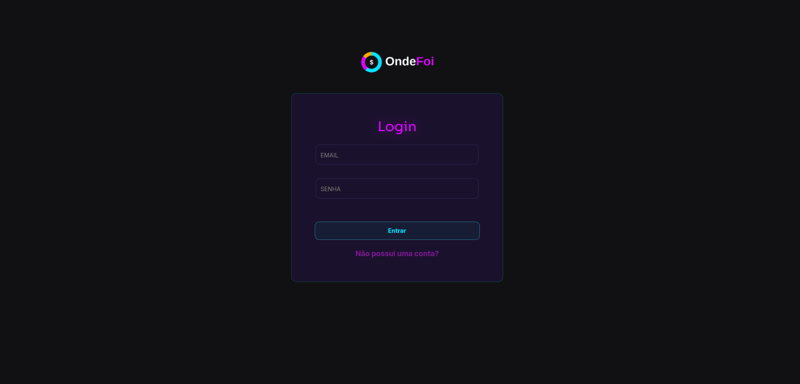
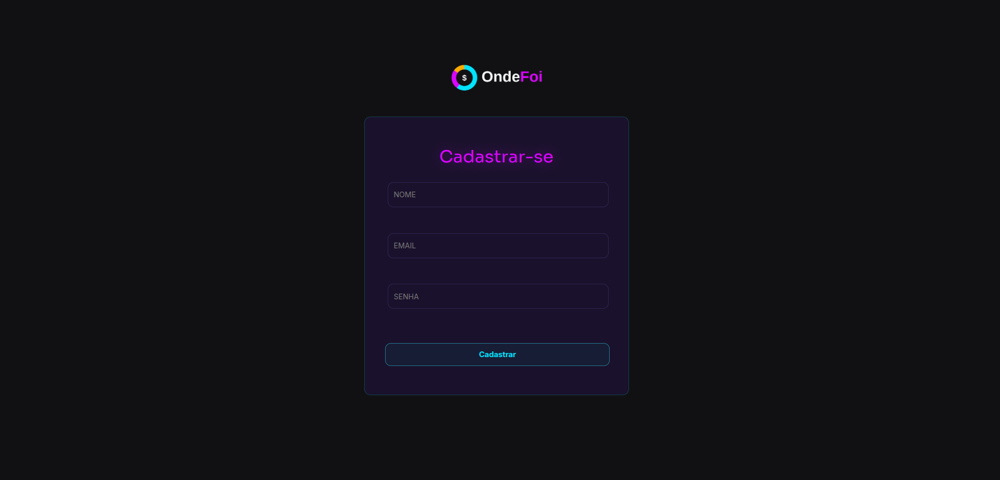
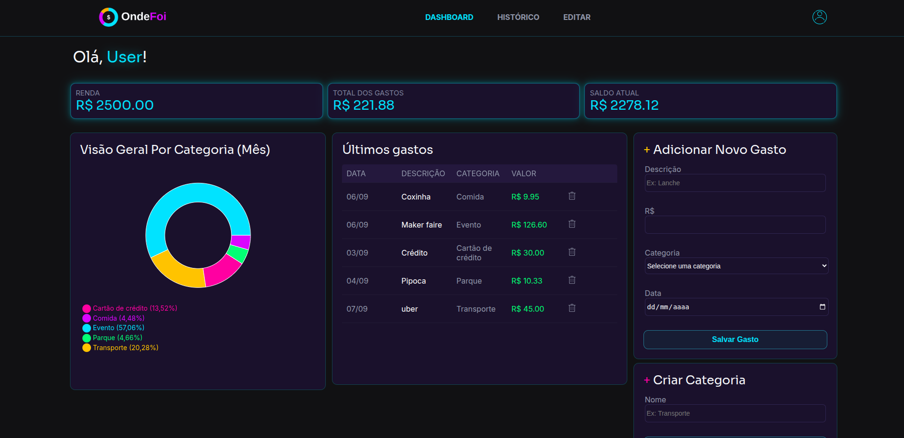
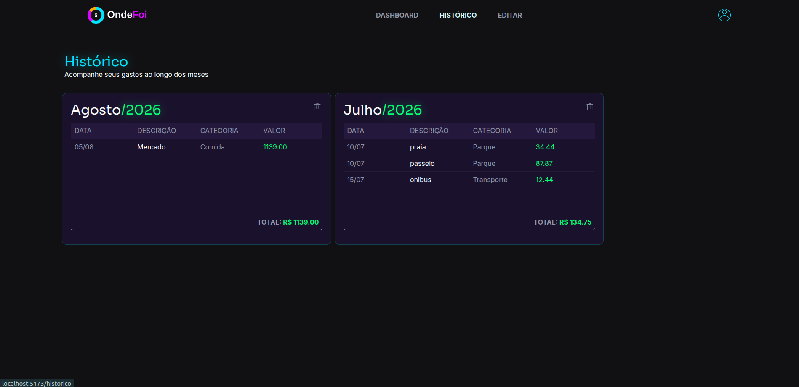
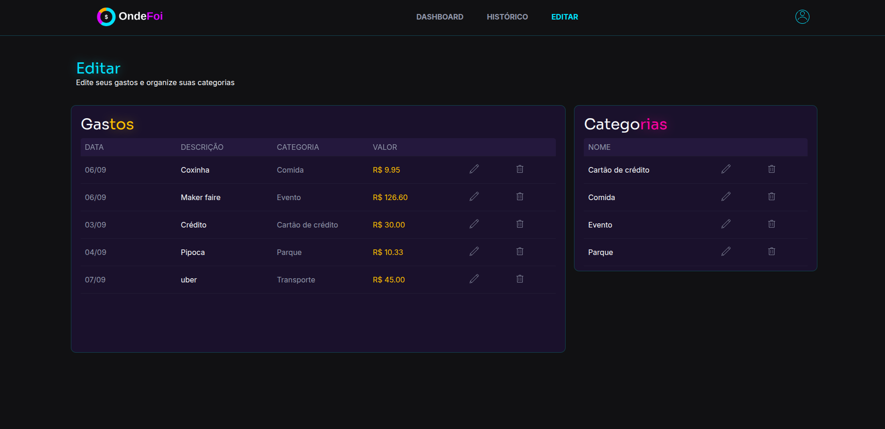
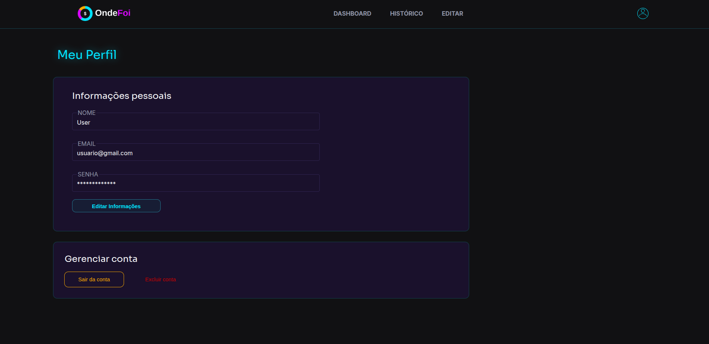

# OndeFoi

Sistema web para controle de gastos pessoais, desenvolvido como projeto de estudo com o objetivo de aprender, na prática, a criação de uma **API REST com C# e ASP.NET Core** e sua integração com uma aplicação **React**.

O sistema permite cadastrar categorias e gastos, visualizar informações financeiras em um dashboard e gerenciar os dados cadastrados.

> **Objetivo do projeto:** colocar em prática conceitos de desenvolvimento de APIs REST, acesso a banco de dados e integração entre backend e frontend.

---

## 📌 Funcionalidades

* Cadastro e login de usuários
* Autenticação de usuários
* Cadastro de categorias
* Edição e exclusão de categorias
* Cadastro de gastos
* Edição e exclusão de gastos
* Associação de gastos a categorias
* Dashboard com informações financeiras
* Cálculo de:

  * Renda
  * Total de gastos
  * Saldo
  * Total gasto por categoria
* Visualização dos gastos por categoria através de gráfico
* Consulta e organização dos gastos por período
* Exclusão do histórico de gastos por mês

> **Observação:** atualmente a interface foi desenvolvida para desktop e não possui responsividade para dispositivos móveis.

---

## 🖥️ Demonstração

### Login


### Cadastro


### Dashboard


### Histórico



### Editar



### Perfil



---

## 🛠️ Tecnologias utilizadas

### Backend

* **C#**
* **.NET 8**
* **ASP.NET Core Web API**
* **Entity Framework Core**
* **MySQL**
* **Pomelo.EntityFrameworkCore.MySql**
* **JWT**
* **Swagger**

### Frontend

* **React**
* **Vite**
* **Axios**
* **React Router**
* **Recharts**
* **CSS**

---

# 🚀 Como executar o projeto

Para executar o projeto localmente, é necessário ter instalado:

* .NET 8 SDK
* Node.js
* npm
* MySQL Server
* Git

Também é recomendado utilizar o **MySQL Workbench** para facilitar o gerenciamento do banco de dados.

---

## 1. Clone o repositório

```bash
git clone https://github.com/SEU-USUARIO/SEU-REPOSITORIO.git
```

Entre na pasta do projeto:

```bash
cd OndeFoi
```

---

# 🗄️ Configuração do banco de dados

O sistema utiliza **MySQL** para armazenar os dados.

Primeiro, certifique-se de que o MySQL Server esteja instalado e em execução.

No backend, localize o arquivo:

```text
appsettings.json
```

Configure a connection string de acordo com as configurações do seu computador:

```json
{
  "ConnectionStrings": {
    "DefaultConnection": "Server=localhost;Port=3306;Database=OndeFoi;User=root;Password=SUA_SENHA;"
  }
}
```

Altere:

* `Server` caso o MySQL esteja em outro endereço;
* `Port` caso esteja utilizando outra porta;
* `User` para o usuário do MySQL;
* `Password` para a senha configurada no seu MySQL.

> **Importante:** não publique sua senha do MySQL no GitHub. Em um projeto público, o ideal é utilizar variáveis de ambiente ou um arquivo de configuração local que não seja versionado.

---

# 🔄 Criando o banco através das migrations

Depois de configurar a conexão com o MySQL, abra um terminal dentro da pasta do backend e execute:

```bash
dotnet ef database update
```

Esse comando aplica as migrations do Entity Framework Core e cria ou atualiza as tabelas necessárias no banco de dados.

Caso o comando `dotnet ef` não esteja instalado:

```bash
dotnet tool install --global dotnet-ef
```

Depois, execute novamente:

```bash
dotnet ef database update
```

---

# ⚙️ Executando o Backend

Entre na pasta do backend:

```bash
cd backend
```

Restaure as dependências:

```bash
dotnet restore
```

Execute a API:

```bash
dotnet run
```

A API será iniciada localmente.

Por exemplo:

```text
http://localhost:5294
```

A porta pode ser diferente dependendo da configuração do projeto.

---

## 📖 Swagger

Com a API executando, é possível acessar o Swagger para visualizar e testar os endpoints:

```text
http://localhost:5294/swagger
```

O Swagger permite testar as requisições da API diretamente pelo navegador.

---

# ⚛️ Executando o Frontend

Abra outro terminal e entre na pasta do frontend:

```bash
cd frontend
```

Instale as dependências:

```bash
npm install
```

Depois execute o projeto:

```bash
npm run dev
```

O Vite exibirá no terminal o endereço para acessar a aplicação, normalmente:

```text
http://localhost:5173
```

---

# 🔗 Configuração da API no React

O frontend utiliza **Axios** para realizar as requisições para o backend.

A URL base da API está configurada no arquivo:

```text
src/services/api.js
```

Exemplo:

```javascript
const api = axios.create({
    baseURL: "http://localhost:5294/api"
});
```

Caso o backend esteja executando em outra porta, altere essa URL para corresponder à porta utilizada pela API.

---

# 🔐 Autenticação

O sistema possui autenticação de usuários utilizando **JWT (JSON Web Token)**.

Após o login, o token é utilizado nas requisições que necessitam de autenticação, permitindo que a API identifique o usuário que está realizando cada operação.

---

# 📡 Endpoints da API

A API possui endpoints para gerenciamento de usuários, categorias, gastos e informações do dashboard.

## Categorias

| Método | Endpoint               |
| ------ | ---------------------- |
| GET    | `/api/Categorias`      |
| POST   | `/api/Categorias`      |
| PUT    | `/api/Categorias/{id}` |
| DELETE | `/api/Categorias/{id}` |

## Dashboard

| Método | Endpoint         |
| ------ | ---------------- |
| GET    | `/api/Dashboard` |

## Gastos

| Método | Endpoint                    |
| ------ | --------------------------- |
| GET    | `/api/Gastos`               |
| POST   | `/api/Gastos`               |
| PUT    | `/api/Gastos/{id}`          |
| DELETE | `/api/Gastos/{id}`          |
| GET    | `/api/Gastos/historico`     |
| DELETE | `/api/Gastos/historico/mes` |

## Usuários

| Método | Endpoint                |
| ------ | ----------------------- |
| GET    | `/api/Usuario`          |
| POST   | `/api/Usuario/cadastro` |
| POST   | `/api/Usuario/login`    |
| POST   | `/api/Usuario/refresh`  |
| PUT    | `/api/Usuario`          |
| PUT    | `/api/Usuario/renda`    |
| DELETE | `/api/Usuario`          |

---

# 📚 O que foi praticado

O principal objetivo deste projeto foi utilizar o desenvolvimento de uma aplicação real como forma de aprendizado.

Durante o desenvolvimento foram praticados conceitos como:

* Criação de APIs REST
* HTTP e seus principais métodos
* Controllers
* Services
* Repository Pattern
* DTOs
* Entity Framework Core
* Migrations
* Relacionamentos entre entidades
* Consultas utilizando LINQ
* MySQL
* Validação de dados
* Autenticação
* Middleware
* CORS
* Consumo de APIs com Axios
* React e seus principais conceitos
* React Router
* Gerenciamento de estado com `useState`
* Efeitos com `useEffect`
* Componentização
* Criação de gráficos com Recharts
* Integração entre frontend e backend

---

# 🎯 Objetivo do projeto

O **OndeFoi** foi desenvolvido principalmente como uma forma de **aprender e consolidar conhecimentos de desenvolvimento web**.

O foco do projeto foi compreender, na prática, como criar uma **API REST utilizando C# e ASP.NET Core**, trabalhar com um banco de dados MySQL e integrar essa API a uma aplicação desenvolvida em **React**.

Em vez de trabalhar apenas com exemplos isolados, a proposta foi desenvolver uma aplicação funcional, utilizando esses conceitos em conjunto para entender melhor como as diferentes partes de uma aplicação web se comunicam.

O projeto também possibilitou praticar conceitos de organização do backend, acesso a dados, validação, autenticação e desenvolvimento de interfaces.

---

## 👩‍💻 Sobre

Projeto desenvolvido para fins de estudo durante o curso de **Análise e Desenvolvimento de Sistemas**.

O foco principal foi aprender, na prática, o desenvolvimento de uma **API REST com C# e ASP.NET Core** e sua integração com **React**, utilizando **MySQL** como banco de dados.

